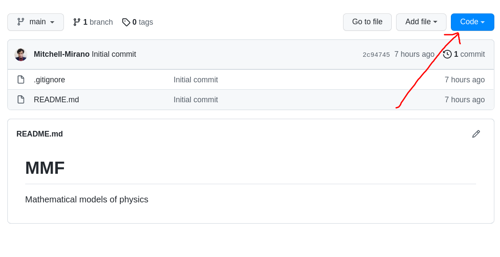
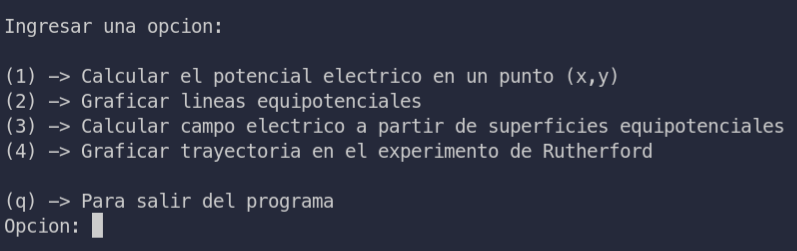

# Modelos Matemáticos de la Física

# Instalacion:

.1) Descargar esta carpeta

moverse hacia donde indica la siguiente imagen

le aparecera 3 opciones, descargar por http, shh o como un archivo com primido.

Si tiene instalado git ejecutar.

    git clone https://github.com/Mitchell-Mirano/MMF.git

en su terminal.

. 2) Una vez descargado moverse hacia la carpeta  y crear un entorno virtual de python
    con los siguientes comandos Linux

    crear entornovirtual ->  python3 -m venv env 
    activar entorno virtual -> source env/bin/activate

. 3)  Instalar las librerias de python necesarias para el programa

    Instalar librerias -> pip install -r requirements.txt

. 4) Ejecutar el programa corriendo el archivo main.python

    Ejecutar programa -> python main.py

Se habriara un menu de opciones donde le pedira ingresar
los datos necesarios para hacer los calculos

La proxima vez que quiera  Ejecutar el programa
solo debera activar el entorno virtual y correr
el archivo main.py

# Uso

Cuando ejecute el programa le aparecera varias opciones:

Elija la opción de su preferecia e ingrese los datos que el programa le pide.

la opcion 2 y 3 puedes recibir listas de pyton como argumento.

por ejemplo: 

    [-3,-2,5,6,7] para la primera opción

    [-3*10**-13,3*10**-13] para la segunda opción

# Opcional

Este proyecto es de codigo libre asi que todos estan invitados a aportar en su desarrollo y mejora.

